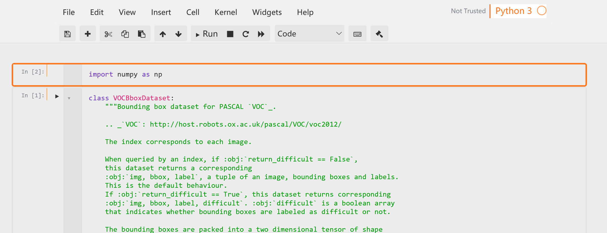

# Jupyter Custom UI

## Requirements
install jupyterthemes
```
python3 -m pip install --upgrade pip
python3 -m pip install jupyter
pip install --upgrade jupyterthemes
```

## Steps

- Change jupyter theme to grade3
  ```
  jt - t grade3 -T -N
  ```
- Replace its default css file
  open your jupyter configuration path, for Windows users, it may locate at `username\.jupyter\custom`.
  rename `custom.css` to `custom.css.bak` in case you need original file one day.
  copy `custom.css` in my repo to that path.
  launch your jupyter notebook
  `jupyter notebook`
  you will see UI change. 
 
